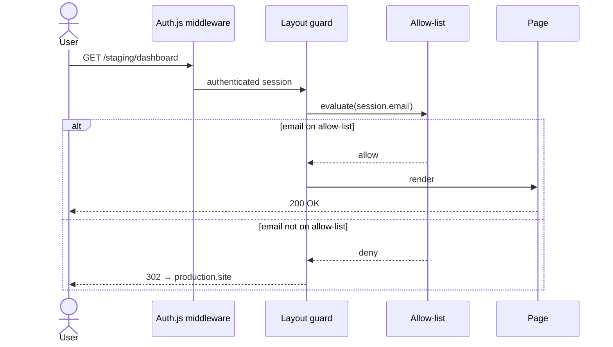

# diagram — complexity-aware diagram generation

## Quick summary

**Goal:** Produce a diagram that matches the complexity of what it describes. Use the cheapest format that still makes the shape clear — ASCII when the flow fits in a plain-text box, Mermaid when it does not.

**Workflow:** Measure → Choose → Produce → **Re-measure on every change**.

**Key rules:**
- Always measure complexity *before* choosing a format. Do not default to Mermaid.
- Re-measure whenever the input changes. A diagram that was ASCII last turn may need to become Mermaid this turn (or vice versa).
- Emit only the diagram and a one-line complexity note. No explanatory prose unless asked.

---

## Step 1 — Measure complexity

Count these four dimensions from the input:

| Dimension | What counts |
| --- | --- |
| **Nodes** | Distinct participants, components, states, boxes |
| **Edges** | Distinct connections, messages, transitions, arrows |
| **Branches** | Conditionals, alternative paths, loops, parallel forks |
| **Annotations** | Labels, notes, payload shapes, guards, timing constraints |

Compute a **complexity score**:

```
score = nodes + edges + (branches × 2) + (annotations × 0.5)
```

Branches count double because they dominate visual noise in ASCII.

Write the count out loud before picking a format — never skip to the answer:

> nodes=4, edges=5, branches=1, annotations=2 → score = 4 + 5 + 2 + 1 = 12

## Step 2 — Choose format

| Score | Format | Reason |
| --- | --- | --- |
| ≤ 6 | **ASCII** | Fits in plain text, renders everywhere, zero toolchain |
| 7 – 12 | **Mermaid** | Multiple interactions or a branch — ASCII arrows will blur |
| ≥ 13 | **Mermaid**, split into multiple diagrams | One picture per logical slice; a 20-node Mermaid is its own kind of unreadable |

**Hard overrides** (regardless of score):

- Any sequence with **≥ 3 participants** → Mermaid `sequenceDiagram`
- Any state machine → Mermaid `stateDiagram-v2`
- **Branches ≥ 2** → Mermaid flowchart
- Destination is a **plain-text medium** (commit message, terminal output, `.txt`, email) → **ASCII only**, no matter the score
- Destination is a Markdown file rendered by GitHub / GitLab / VS Code → Mermaid is safe

## Step 3 — Produce the diagram

### If ASCII

Use Unicode box-drawing characters for clean rendering:

```
─ │ ┌ ┐ └ ┘ ├ ┤ ┬ ┴ ┼ → ← ↑ ↓
```

Fall back to `-`, `|`, `+`, `>` when the target is a non-Unicode terminal or the user asks.

Preferred ASCII shapes:

- **Linear flow:** `Client → API → DB → API → Client`
- **Fan-out / fan-in:** one source with 2–3 arrows to targets
- **Component inventory:** labelled boxes side-by-side

Size budget: **≤ 15 columns wide × ≤ 10 rows tall**. If you exceed it, stop and re-measure — complexity has grown past ASCII's comfort zone.

### If Mermaid

Pick the Mermaid diagram type that fits the shape:

| Input shape | Mermaid type |
| --- | --- |
| Ordered interaction between actors / services | `sequenceDiagram` |
| Decision tree, control flow | `flowchart TD` (top-down) or `flowchart LR` (left-right) |
| Component relationships, module map | `flowchart LR` with subgraphs |
| Stateful entity with transitions | `stateDiagram-v2` |
| Class / data relationships | `classDiagram` or `erDiagram` |

Size budget: **≤ 25 lines of Mermaid source per diagram**. If longer, split into two diagrams covering different slices (e.g., "happy path" + "error path").

## Step 4 — Re-measure on every change

**This step is not optional.** Whenever the input changes — user adds a participant, removes a branch, redirects to a different destination, simplifies the flow — **re-run Step 1 and Step 2 from scratch**. Do not assume the previous format still fits.

Common triggers for format switching:

| Change | Likely format impact |
| --- | --- |
| User adds a new branch or alternative path | Score jumps by ≥ 2 — often pushes ASCII → Mermaid |
| User adds a third participant to a sequence | Hard override fires → ASCII → Mermaid |
| User simplifies the flow (fewer nodes/edges) | Score drops — consider downgrading Mermaid → ASCII |
| User retargets the output (e.g., "put this in the commit message") | Plain-text override fires → Mermaid → ASCII |

**When the format switches, state it explicitly in one line before the new diagram:**

> Complexity went from 5 → 9 (added two branches). Switching from ASCII to Mermaid.

**When the format stays the same:**

> Complexity 4 → 4. Still ASCII. Updated version below.

## Output rules

- Emit **only** the diagram and a one-line complexity note (`score: N (n=…, e=…, b=…, a=…), format: ASCII | Mermaid`). No explanatory prose unless the user asks for it.
- Wrap Mermaid in a ```` ```mermaid ```` fenced block.
- Wrap ASCII in a plain ```` ``` ```` fenced block (no language tag).
- Never mix Mermaid and ASCII within a single diagram.
- Never invent participants, steps, or interactions that are not in the input. If the input is ambiguous or incomplete, ask one clarifying question instead of guessing.
- Do not add titles, legends, or footnotes unless the input explicitly names them.

## Worked example

**Input:** "Show how a user sign-in request flows through Auth.js v5 middleware, a layout guard, and an allow-list check before hitting the page."

**Step 1:** nodes = 5 (user, middleware, layout guard, allow-list, page), edges = 6, branches = 1 (allow-listed vs redirected), annotations = 1 (302 redirect label). Score = 5 + 6 + 2 + 0.5 = **13.5**.

**Step 2:** Score ≥ 13 AND ≥ 3 participants in a sequence → **Mermaid `sequenceDiagram`**. Could split, but the flow is linear enough that one diagram fits the 25-line budget.

**Step 3:**

> score: 13.5 (n=5, e=6, b=1, a=1), format: Mermaid

````markdown

````

**Step 4 trigger (hypothetical):** User then says "drop the allow-list check, just keep the middleware → guard → page flow and put it in the commit message." → Re-measure: nodes = 4, edges = 3, branches = 0, annotations = 0 → score = **7**. BUT destination is a commit message → plain-text override fires → **ASCII**. Format switches from Mermaid to ASCII.
