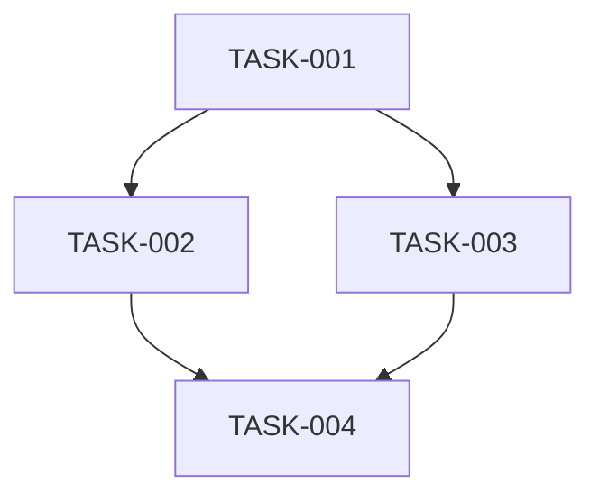

# Tasks: {{FEATURE_NAME}}

> **Only for Large changes.** Small and Medium changes skip tasks.md -- the agent handles sequencing implicitly during implementation.

**Spec:** `spec/{{feature-slug}}/{{subfeature-slug}}/spec.md`
**Plan:** `spec/{{feature-slug}}/{{subfeature-slug}}/plan.md`
**Status:** Draft

---

## Tasks

### TASK-001: [Title — one clear deliverable]

- **Files:** `exact/path/to/create.ext` (NEW), `exact/path/to/modify.ext` (MODIFY)
- **Dependencies:** none
- **Complexity:** S / M / L
- **Verifies:** REQ-001 -> AC-001
- **Evidence:** `spec/{feature}/{subfeature}/verification-report.md` row for AC-001

Steps:
- [ ] [Concrete action — what to build/change]
- [ ] [Write test that verifies the behavior]
- [ ] [Run test, confirm it passes]
- [ ] [Record Test Location + Command in verification-report.md row for AC-001]
- [ ] [Commit]

### TASK-002: [Title]

- **Files:** `exact/path/to/file.ext`
- **Dependencies:** TASK-001
- **Complexity:** S / M / L
- **Verifies:** REQ-002 -> AC-002
- **Evidence:** `spec/{feature}/{subfeature}/verification-report.md` row for AC-002

Steps:
- [ ] [Concrete action]
- [ ] [Write test]
- [ ] [Run test, confirm pass]
- [ ] [Record Test Location + Command in verification-report.md row for AC-002]
- [ ] [Commit]

<!-- Continue for all tasks... -->

---

## Dependency Graph

## Traceability

| REQ ID | Task(s) |
|--------|---------|
| REQ-001 | TASK-001, TASK-002 |
| REQ-002 | TASK-003 |

Every REQ must appear. No orphan REQs.

## Task Rules

- Each task touches at most 3 files
- No task depends on a task that appears later (no forward references)
- DB migrations are separate tasks from code that uses them
- Clearly independent tasks are marked as parallelizable
- Zero placeholders: no "TBD", "TODO", "add appropriate handling", "similar to Task N"
