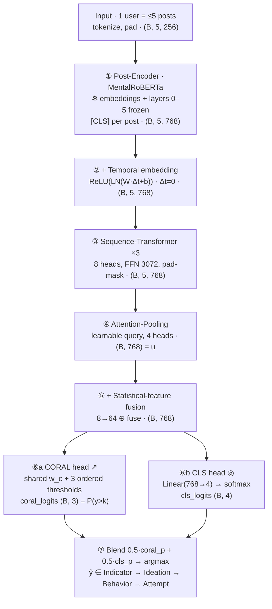

# R2 · Hierarchical Dual-Head Architecture for Ordinal Suicide-Risk Classification

> Static architecture spec. Every config value is taken directly from the `Config` dataclass and the
> modules in [`kaggle/finetuning-message/r2-suicide-risk-dualhead/r2-suicide-risk-dualhead.py`](../../kaggle/finetuning-message/r2-suicide-risk-dualhead/r2-suicide-risk-dualhead.py).
> Visual companions: [`r2-architecture-detail.html`](./r2-architecture-detail.html) (detailed) ·
> [`r2-architecture-training-animation.html`](./r2-architecture-training-animation.html) (animated training flow).
>
> Reimplementation of Yang et al., *Hierarchical Dual-Head Model for Suicide Risk Assessment via MentalRoBERTa*
> (IEEE BigData 2025; arXiv:2510.20085). Dataset: Reddit C-SSRS 500 users (Gaur et al., Zenodo 2667859, CC-BY-4.0).

**Headline numbers** (verified gold-holdout runs, 2026-06-27):

| Framing | Metric |
|---|---|
| Gold-holdout macro-F1 | **0.385** (CORAL+CE+Focal) → **0.418** (CORN+GCE) |
| Within-distribution 5-fold CV macro-F1 | **0.653 ±0.005** (vs paper 0.5098, +28% rel) |
| QWK (ordinal) | **~0.39** |

---

## 1. Overview — forward flow

A user is represented by their **5 most recent posts**. Each post is encoded independently, the sequence is
contextualized, pooled into one vector, fused with statistical features, and read out by **two complementary
heads** (an ordinal CORAL head + a nominal 4-way classifier) whose probabilities are blended for the final
ordinal prediction.



**3D feature-map view (VGG-style):** block height ∝ sequence length (5 posts → 1 after pooling); block
thickness ∝ hidden dimension (256 → 768 → 4).

```
 5×256      5×768       5×768       1×768     1×768      B×3 / B×4     4
[Input] -> [Encoder] -> [Context] -> [Pool] -> [Fuse] -> [Dual-Head] -> [ŷ]
tokenize   RoBERTa      +Δt          Attn      ⊕feats    CORAL / CLS    argmax
           [CLS] ❄50%   Seq-Trf ×3   pool
```

---

## 2. Module-by-module detail

| # | Module | Task | Input → Output | Key config |
|---|--------|------|----------------|------------|
| 0 | **Input / tokenization** (`CSSRSDataset`, `AutoTokenizer`) | Take 5 most recent posts, augment (train), tokenize, pad sequence + tokens | `list[str]` → `input_ids,mask (B,5,256)`, `valid (B,5)`, `dt (B,5)`, `feats (B,8)` | `seq_len=5`, `max_length=256`, `aug_prob=0.5` |
| 1 | **Post-Encoder · MentalRoBERTa** (`AutoModel`) | Encode each post independently; take `[CLS]` = `last_hidden_state[:,0]` | `input_ids (B·5, 256)` → `post-emb (B, 5, 768)` | backbone `welsachy/mental-roberta-base-finetuned-depression` (base = MentalRoBERTa, 12 layers, h=768) |
| 2 | **Temporal embedding** (`time_fc`,`time_ln`,`time_drop`) | Embed Δt and add to each post-embedding: `e + ReLU(LN(W·Δt+b))` | `dt (B,5,1) + e (B,5,768)` → `(B, 5, 768)` | `Linear(1,768)`→`LayerNorm(768)`→ReLU→`Dropout(0.3)`; Δt=0 (no timestamps) |
| 3 | **Sequence Transformer ×3** (`nn.TransformerEncoder`) | Self-attention **mixing information across the 5 posts** (`src_key_padding_mask=~valid`) | `(B,5,768)` → `(B,5,768)` contextualized | `d_model=768`, `nhead=8`, `dim_feedforward=3072`, `dropout=0.3`, gelu, ×3 |
| 4 | **Attention-Pooling** (`query`, `nn.MultiheadAttention`) | A learnable query attends over the sequence → one sequence vector (Q=query, K=V=seq) | `query (B,1,768) + seq (B,5,768)` → `u (B, 768)` | `query (1,1,768)·0.02`, `MultiheadAttention(768, heads=4, dropout=0.3)` |
| 5 | **Statistical-feature fusion** (`feat_mlp`, `fuse`) | MLP-encode 8 post-length stats and fuse into the sequence vector | `u (B,768) + feats (B,8)` → `u (B, 768)` | `Linear(8,64)→ReLU→Linear(64,64)→ReLU`; `fuse: Linear(768+64,768)` |
| 6 | **Dual Head** (`coral_fc`,`coral_bias`,`cls_head`) | Two complementary read-outs from `u` | `u (B,768)` → `coral_logits (B,3)`, `cls_logits (B,4)` | CORAL: `Linear(768,1,bias=False)` shared `w_c` + `coral_bias(3)` ordered thresholds; CLS: `Linear(768,4)` |

`feats` = `[mean, std, min, max]` of per-post word counts **+ 4 zeros** (time-interval stats, currently unavailable) = 8 dims.

---

## 3. Dual-head & blending

**CORAL → per-class probabilities** (cumulative `P(y>k)` → per-class):

```
P(y>k) = σ(coral_logits)          # k = 0..2
probs[0] = 1 − P(y>0)
probs[k] = P(y>k−1) − P(y>k)
probs[3] = P(y>2)                 # ordering guaranteed by ordered thresholds
```

**Blend at evaluation** (only heads that were actually trained are blended):

```
coral_p = coral_to_probs(coral_logits)
cls_p   = softmax(cls_logits)
p_final = 0.5·coral_p + 0.5·cls_p     # if both heads active
ŷ       = argmax(p_final)              # ablation: a single active head is used alone
```

CORAL provides **ordinality** (confusing Indicator↔Attempt is penalized more than adjacent confusions);
CLS provides **per-class sharpness**. A 50/50 blend keeps both.

---

## 4. Loss — tri-objective (paper eq. 4)

```
L = 0.5·L_CORAL + 0.3·L_CE(label_smoothing=0.1) + 0.2·L_Focal(γ=2)
        # weights are env-gated for ablation: R2_W_CORAL / R2_W_CE / R2_W_FOCAL

L_CORAL = BCEWithLogits(coral_logits, t),   t_k = 1[y > k]      # cumulative binary targets
L_Focal = mean( −α_y · (1−p_y)^γ · log p_y ),  α = N / (C · count)   # α = inverse class frequency
```

> The **shipped** model uses CORAL+CE+Focal. The **latest** method replaces CORAL→**CORN** (independent
> weight per threshold) and Focal→**GCE** (down-weights low-confidence samples) — see §8.

---

## 5. Hyperparameters (`Config`)

| Group | Parameter | Value |
|-------|-----------|-------|
| Architecture | `seq_len` · `max_length` · `n_classes` | `5 · 256 · 4` |
| | `freeze_layers` · `n_transformer_layers` · `n_heads` · `ffn_dim` | `6 · 3 · 8 · 3072` |
| | `pool_heads` · `dropout` · `use_features` | `4 · 0.3 · True` |
| Loss | `w_coral` · `w_ce` · `w_focal` | `0.5 · 0.3 · 0.2` |
| | `label_smoothing` · `focal_gamma` | `0.1 · 2.0` |
| Optimization | `lr_encoder` · `lr_new` · `weight_decay` | `2e-5 · 1e-4 · 0.01` |
| | optimizer · scheduler · `warmup_ratio` | `AdamW · cosine · 0.1` |
| | `batch_size` · `grad_accum` (eff.) · `max_grad_norm` | `8 · 2 (16) · 1.0` |
| Training | `epochs` · `patience` · `n_folds` · `seed` | `10–15 · 5 · 5 · 42` |
| | `aug_prob` · AMP | `0.5 · fp16 (CUDA)` |

**Discriminative learning rates:** parameters named `encoder.*` use `2e-5`; every new module
(temporal/seq/pool/feat/fuse/heads) uses `1e-4`. Parameters with `requires_grad=False` are excluded from the optimizer.

---

## 6. Data & evaluation protocol

**Two evaluation framings:**

| Framing | Train | Eval |
|---------|-------|------|
| **Gold-holdout** | LLM-labeled pool (av9ash + scraped) | held-out clinical CSSRS-500 |
| **Within-distribution** | 5-fold StratifiedKFold over the full ~10k | (same distribution) |

**Labels** (5 C-SSRS levels → 4 ordinal levels, dropping "Supportive"): `Indicator 0 · Ideation 1 · Behavior 2 · Attempt 3`.

**Text augmentation** (train only, `p=0.5` per post): `delete` (~10% words), `swap` (two words), `synonym` (WordNet).

**Class-balanced sampling** (`R2_BALANCE`): `WeightedRandomSampler`, weight `= N/count` (inverse frequency) to lift the
rare Behavior class (only 6.5% of the pool).

---

## 7. Variants / ablation (same architecture, different loss config; gold-holdout)

| Configuration | `w_coral / w_ce / w_focal` | Gold macro-F1 | Behavior-F1 | QWK |
|---------------|----------------------------|---------------|-------------|-----|
| dual-head (shipped) | `0.5 / 0.3 / 0.2` | 0.385 | 0.183 | ~0.39 |
| flat-CE (ablation) | `0 / 1 / 0` | 0.422 | 0.285 | low (nominal) |
| **CORN + GCE** (latest) | replaces CORAL+Focal | **0.418** | **0.317** | ~0.39 |
| within-dist 5-fold | `0.5 / 0.3 / 0.2` | **0.653 ±0.005** > paper 0.5098 (+28% rel) | — | — |

Per-class gold F1 (dual-head): Indicator **0.50** · Ideation **0.48** · Behavior **0.18** · Attempt **0.37**.
Behavior is the macro-F1 bottleneck — the target of the three improvements below.

---

## 8. Three latest improvements (deltas vs the shipped model)

1. **CORN + GCE — noise-robust ordinal loss (backbone change).** Replace **CORAL** (one shared weight → a single
   noisy rare label corrupts every threshold) with **CORN** (independent weight per threshold), and **Focal**
   with **GCE** (down-weights low-confidence samples). → Behavior-F1 0.183 → **0.317**, gold 0.385 → **0.418**,
   ordinality preserved (QWK ~0.39). Changes the **head + loss**.
2. **Label-shift correction — fixes the LLM→gold label shift (inference-time, no retraining).** Measured
   `π_gold/π_train` for Behavior = **3.0×** (LLM under-labels); post-hoc **Logit-Adjustment** adds `log w(y)`
   to the logits. → Behavior-F1 0.357 → **0.41** (oracle 0.44), macro +0.005→+0.029. Changes **inference only**.
3. **Ordinal-aware Confident Learning — hierarchy-aware label cleaning (data-side).** Confident-joint weighted by
   `|ỹ−ŷ|²`: cleans **100% of far errors** (Behavior→Indicator) while keeping **78% of adjacent borderline** cases
   (nominal Cleanlab wrongly flags 45% of adjacent cases). → diagnoses 35.8% of Behavior labels as suspect;
   clinically correct cleaning. Changes **data preprocessing**.

---

## 9. Frozen vs trainable map

| Component | State | LR group |
|-----------|-------|----------|
| `encoder.embeddings.*` | ❄ frozen | — |
| `encoder.layer.0–5` (first 6 layers) | ❄ frozen | — |
| `encoder.layer.6–11` (top 6 layers) | 🔥 train | `2e-5` |
| `time_fc` · `time_ln` | 🔥 train | `1e-4` |
| `seq_encoder` (×3 transformer) | 🔥 train | `1e-4` |
| `query` · `pool` | 🔥 train | `1e-4` |
| `feat_mlp` · `fuse` | 🔥 train | `1e-4` |
| `coral_fc` · `coral_bias` · `cls_head` | 🔥 train | `1e-4` |

**Why freeze 50% of the encoder:** the clinical dataset is small → keep low-level linguistic knowledge and only
fine-tune the upper layers + the new heads, reducing overfitting. New modules learn faster than the encoder
(`1e-4` ≫ `2e-5`).
