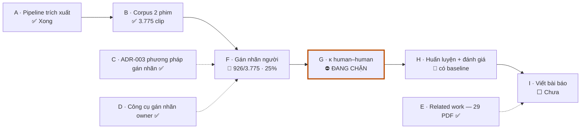
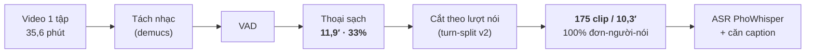

# Báo cáo tiến độ — ViEmoSpeech

**Người thực hiện:** Nguyễn Duy Tấn Phát (dev.phatdt)
**Kỳ báo cáo:** 2026-07-03 → **2026-08-01** · **Đề tài:** ViEmoSpeech — xây dựng
corpus nhận dạng cảm xúc từ giọng nói (SER) tiếng Việt + phương pháp bimodal
**tone × emotion**.

> Mọi con số trong báo cáo này đều truy được về một file trong repo (đường dẫn ghi
> ở cột "Nguồn" hoặc ở §5). Toàn bộ §4 là **số đã đo**; chỗ nào là ước lượng đều
> được ghi rõ ngay tại chỗ.

---

## 1. Tóm tắt (đọc phần này là đủ)

### 1.0 Đề tài này làm gì

**Bài toán.** *Speech Emotion Recognition* (SER) — nhận diện cảm xúc từ giọng nói:
máy nghe một đoạn thoại và đoán người nói đang vui, buồn, giận, sợ hay bình thường.
Ứng dụng ở tổng đài chăm sóc khách hàng, trợ lý ảo, và sàng lọc sức khoẻ tinh thần.

**Vướng ở đâu với tiếng Việt.** Muốn huấn luyện mô hình thì phải có **dữ liệu giọng
nói đã gán nhãn cảm xúc**. Tiếng Anh có nhiều bộ lớn và dùng được tự do; tiếng Việt
thì **gần như không có bộ nào vừa lấy được, vừa là lời nói tự nhiên, vừa có giấy
phép rõ ràng**. Nghĩa là ở Việt Nam, bài toán này **chưa có điểm xuất phát** — không
có dữ liệu thì không có gì để so sánh, cũng không có gì để cải tiến.

**Đề tài làm hai việc, theo thứ tự:**

1. **Xây bộ dữ liệu (ViEmoSpeech).** Lấy thoại từ phim truyền hình Việt Nam, tách
   nhạc nền, cắt thành từng câu nói của **một người**, rồi cho **người thật nghe và
   gán nhãn cảm xúc**. Sản phẩm là bộ dữ liệu công bố công khai dưới giấy phép
   CC-BY — thứ hiện chưa tồn tại cho tiếng Việt.

2. **Bài báo phương pháp trên bộ dữ liệu đó.** Chỗ này mới là phần khoa học.

**Ý tưởng khoa học trung tâm.** Tiếng Việt là **ngôn ngữ thanh điệu**: cao độ giọng
quyết định *nghĩa của từ* (ma ≠ má ≠ mà ≠ mã ≠ mạ). Nhưng cao độ **cũng chính là**
kênh mà cảm xúc dùng để bộc lộ — người ta lên giọng khi giận, chùng giọng khi buồn.
Hai thứ **giành nhau một kênh âm thanh**.

Hệ quả kéo theo: ở tiếng Việt, nghe giọng thôi **không đủ** để đoán cảm xúc như ở
tiếng Anh, vì một phần biến thiên cao độ đã bị "trưng dụng" để chở thanh điệu. Vậy
mô hình phải **dựa nhiều hơn vào nội dung lời nói** (nhánh văn bản). Đây là giả
thuyết **đo được** và **chưa ai kiểm chứng** cho bất kỳ ngôn ngữ thanh điệu nào —
đó là đóng góp mới của đề tài. Số đầu tiên đã ủng hộ: audio-only cho CCC
valence/arousal ≈ **0,09** (gần sàn) — xem §4.3.

**Ràng buộc cứng, chi phối toàn bộ thiết kế.** Nguồn dữ liệu là phim **có bản
quyền**. Nên bộ dữ liệu phát hành ra ngoài **chỉ gồm đặc trưng âm thanh + mốc thời
gian + nhãn**, **không bao giờ** có file audio hay transcript đầy đủ. Toàn bộ phần
còn lại của báo cáo này đọc dưới ràng buộc đó.

### 1.1 Vì sao chọn đề tài này

| | Lý do | Nội dung |
|---|---|---|
| **①** | **Khoảng trống dữ liệu đang chặn cả lĩnh vực** | Không corpus SER tiếng Việt nào *đồng thời* lấy được + thoại tự do + license rõ. ViSEC mở nhưng **thiếu license**; VLSP 56h nhãn nhị phân, site gated. Ai muốn nghiên cứu cũng phải tự dựng dữ liệu trước. |
| **②** | **Câu hỏi khoa học chỉ ngôn ngữ thanh điệu mới có** | Thanh điệu tiếng Việt đi qua **phonation/chất giọng**, không chỉ F0 (Shen et al., NAACL 2024) — **đúng kênh cảm xúc dùng**. Chưa ai mô hình hoá SER tone-aware cho **bất kỳ** ngôn ngữ thanh điệu nào (chi tiết §2.2). |
| **③** | **Giả thuyết đó đo được — số đầu tiên đã ủng hộ** | Audio-only cho **CCC valence/arousal ≈ 0,09 (gần sàn)**: chỉ nghe âm thanh thì gần như không đọc được cảm xúc. Song song, ASR sai **thanh điệu** đúng ở đoạn cảm xúc mạnh (*"mày → máy"*, *"tao → tháo"*). |
| **④** | **Khả thi bằng nguồn lực một người** | Pipeline tự động cho **33% thời lượng phim** thành thoại sạch đơn-giọng, chạy trên máy cá nhân + GPU Kaggle miễn phí. Không phòng thu, không thuê diễn viên. |

### 1.2 Trạng thái hiện tại

Đã qua giai đoạn "có chạy được không", đang ở giai đoạn **gán nhãn người + đo độ
tin cậy nhãn**. Ba việc đã xong và có số:

1. **Pipeline trích xuất tự động chạy end-to-end** — sơ đồ + số đo ở §4.1.
2. **Corpus đã trích xong 2 bộ phim**: *Về nhà đi con* (10 tập) + *Chạy trốn thanh
   xuân* (22 phần) → **3.775 clip** (~10 giờ thoại đơn-giọng), đã cắt sẵn.
3. **Kết quả huấn luyện đầu tiên trên nhãn NGƯỜI**: macro-F1 emotion **0,249**
   khi đánh giá **trung thực** (train một phim / test phim kia), so với 0,314 khi
   đánh giá "lạc quan". Mức ngẫu nhiên ≈ 0,04 — chi tiết §4.3.

Tiến độ corpus, tính trên tổng 3.775 clip:

```
█████████▊ 926 có nhãn (24,5%)  ████▋ 445 bị loại (11,8%)  ░░░░░░░░░░░░░░░░░░░░░░░░░ chưa duyệt
```

Ba việc đang là **nút thắt**:

| Nút thắt | Vì sao quan trọng | Cần gì để gỡ |
|---|---|---|
| **Chưa có κ human–human** (độ đồng thuận giữa các người gán nhãn) | Không có số này thì bài báo dataset **không qua nổi vòng phản biện** — mọi corpus SER được trích dẫn đều báo κ | Cần **3 annotator thật**. Toàn bộ công cụ + thống kê đã xong và test, chỉ thiếu người |
| **Nhãn người mới phủ ~25% corpus** (926/3.775 clip) | Gán nhãn tuyến tính theo số clip, một mình làm sẽ rất lâu | Chốt **mục tiêu quy mô corpus** — không nhất thiết phải nhãn hết |
| **Chưa chạy benchmark 6 phương pháp trên nhãn người** | Đây là phần "đo" của bài báo phương pháp | Chờ nhãn ổn định + quota GPU Kaggle |

---

## 2. Mục tiêu và đóng góp dự kiến

Đề tài cho ra **hai sản phẩm**:

- **(A) Bài báo corpus** — ViEmoSpeech: corpus SER tiếng Việt đầu tiên **đồng thời**
  free-content (thoại tự nhiên, không phải câu đọc mẫu), đa lớp (7 cảm xúc +
  valence/arousal + cờ distress), có gán thanh điệu, và **license rõ ràng (CC-BY)**.
- **(B) Bài báo phương pháp** — bimodal **tone × emotion**.

### 2.1 Ba khoảng trống mà đề tài lấp

| Khoảng trống | Hiện trạng văn liệu | ViEmoSpeech |
|---|---|---|
| **Corpus** | Không corpus SER tiếng Việt nào vừa *lấy được* + *thoại tự do* + *license rõ*. ViSEC: mở nhưng **thiếu license**; VLSP 56h: nhãn nhị phân + site gated | Trích từ phim truyền hình → thoại tự do; artifact phát hành = đặc trưng + timestamp + nhãn, CC-BY khai báo từ commit đầu |
| **Phương pháp (tone × emotion)** | Chưa ai mô hình hoá SER *tone-aware* cho **bất kỳ** ngôn ngữ thanh điệu nào | Giả thuyết: khi F0 bận "chở" thanh điệu thì nhánh ngữ nghĩa phải gánh nặng hơn |
| **Recall-floor cho distress** | 21/21 bài bimodal trong sweep không đặt recall-floor làm mục tiêu tối ưu | Head distress có sàn recall (nói rõ: **proxy trên phim diễn, không phải nhãn lâm sàng**) |

### 2.2 Luận điểm trung tâm (chưa ai claim, và **đo được**)

Tiếng Việt là ngôn ngữ thanh điệu **thiên về phonation/chất giọng**, không chỉ
đường F0 (Shen et al., **NAACL 2024**) — **đúng kênh mà cảm xúc cũng dùng**. Suy ra
xung đột *thanh điệu × cảm xúc* ở tiếng Việt **mạnh hơn tiếng Quan Thoại**, và
nhánh text/ngữ nghĩa phải gánh nhiều hơn so với SER ở ngôn ngữ phi-thanh-điệu.

**Bằng chứng sớm đã bắt được trong pilot:** ASR (PhoWhisper) sai **thanh điệu** đúng
ở những đoạn cảm xúc mạnh — khi nhân vật quát, *"mày → máy/mây"*, *"tao → tháo"*.
Đây vừa là **rủi ro** (nhánh text bị nhiễu có hệ thống ở high-arousal), vừa là
**bằng chứng thực nghiệm** cho chính giả thuyết của bài báo.

### 2.3 Rủi ro về tính mới (đã rà)

- **arXiv:2601.04564** *"When Tone and Words Disagree"* (01/2026): bimodal audio+text
  nhưng "tone" của họ = *tone-of-voice* (ngữ điệu), **không phải thanh điệu từ vựng**
  → phải cite-and-distinguish tường minh.
- **arXiv:2604.01711** (04/2026, VN SER + LLM reasoning): **nêu tên** vấn đề
  tone-confound trong phần động cơ nhưng **không giải** → khoảng trống có thật,
  nhưng niche đang mở nhanh ⇒ **có áp lực thời gian**.
- **arXiv:2412.09829** (VNU Hà Nội): sau khi đọc toàn văn, bài này **đã bị tác giả
  rút** và **không phải bài SER** → *không tồn tại "số baseline để vượt"* như em ghi
  trong bản tổng quan hồi 07-08; nay định vị lại là "tiền lệ rule-fusion đã rút".

---

## 3. Tiến độ theo khối công việc

Dòng chảy chính của đề tài — từ tập phim thô đến bài báo:



| Khối | Nội dung | Trạng thái | Bằng chứng |
|---|---|---|---|
| **A** | Pipeline trích xuất (video → clip sạch) | ✅ **Xong** — chạy local + kernel Kaggle | `docs/spec/capabilities/extraction-pipeline.md` |
| **B** | Trích corpus 2 bộ phim | ✅ **Xong 3.775 clip** | đĩa `data/vietnamese-ser/episodes/` |
| **C** | Chốt phương pháp gán nhãn (bỏ weak-supervision) | ✅ **Chốt** ADR-003 (2026-07-07) | `docs/spec/decisions/ADR-003-*.md` |
| **D** | Công cụ gán nhãn cho chủ nhiệm (owner) | ✅ **Xong** + 6 vòng cải tiến (change 003–010) | `tools/labeler/` |
| **E** | Related work | ✅ **Xong** — 29 PDF đọc sâu toàn văn + bản dịch tiếng Việt + 18 trang review HTML | `docs/papers/`, `docs/survey-review/` |
| **F** | Gán nhãn người | 🔄 **Đang chạy — 926/3.775 clip (~25%)** | `state.db`, truy vấn 2026-08-01 |
| **G** | Công cụ đa-annotator + đo κ human–human | ✅ **Công cụ xong** · ⛔ **chờ người thật** | change 011 — chi tiết §3.1 |
| **H** | Huấn luyện + đánh giá | 🔄 **Đã có baseline audio-only trên nhãn người**; benchmark 6 phương pháp: harness xong, chưa chạy | `docs/spec/capabilities/training-baseline.md` |
| **I** | Viết bài báo | ⬜ **Chưa bắt đầu** (chờ κ + benchmark) | — |

### 3.1 Khối G — đã dựng xong những gì (change 011)

Đây là khối mới nhất và cũng là khối đang chặn, nên tách riêng. Toàn bộ phần **máy
làm được** đã xong và có kiểm thử; phần còn lại **chỉ người làm được**.

| Thành phần | Việc | Trạng thái |
|---|---|---|
| **ADR-005** | Làm rõ ràng buộc bản quyền: stream clip cho annotator được mời đích danh ≠ "phát hành". Kèm **7 safeguard bắt buộc**. | ✅ |
| **Giao thức** | Hướng dẫn gán nhãn (bài báo sẽ đăng nguyên văn), bản đồng ý tham gia, **giao thức QC pre-registered** — ngưỡng loại annotator chốt *trước* khi nhìn dữ liệu. | ✅ |
| **Backend** | Token đích danh + phân quyền + log truy cập; một middleware làm biên bảo mật; annotator chỉ chạm clip **theo vị trí hàng đợi**, không bao giờ biết id clip. | ✅ |
| **Màn gán nhãn** | **Mù hoàn toàn**: không transcript, không gợi ý LLM, không thấy nhãn người khác — thấy là nhãn bị neo, κ vô nghĩa. | ✅ |
| **Cửa consent** | Ghi ai đồng ý, lúc nào, phiên bản văn bản nào. Chưa đồng ý thì không lấy được clip — chặn ở server, không chỉ ẩn trên giao diện. | ✅ |
| **Màn owner** | Chốt gold set (đếm clip đã thật sự nghe) · so nhãn mọi rater trên từng clip. | ✅ |
| **Script κ** | Fleiss κ + Krippendorff α (nominal & ordinal), tự cài — đối chiếu tính tay khớp tới 6 chữ số. | ✅ |
| **Vòng qualification** | 30 slot: 18 gold + 10 thường + 2 bẫy; gold hai vòng **rời nhau** (dùng lại là đo trí nhớ, không đo việc nghe). | ✅ công cụ |
| **Chốt gold-set** | 58 ứng viên đã lọc sẵn (đồng thuận 3 chiều owner + 2 LLM); cần **nghe và xác nhận thủ công**. | 🔄 chờ owner |
| **Chạy 2 vòng gán nhãn** | Qualification rồi reliability, ~3 người, ~250 clip trùng nhau hoàn toàn. | ⛔ chờ người |

> **Vì sao khối G không thể tự động hoá.** κ đo *mức đồng thuận giữa người với người*.
> Nếu nhãn thứ hai do máy sinh ra thì con số đó không còn nghĩa gì — nó chỉ nói mô
> hình có giống chủ nhiệm hay không, đúng thứ mà ADR-003 đã loại bỏ. Nên khối này
> **bắt buộc** phải có người thật ngồi nghe.
>
> **Rào kỹ thuật mới phát sinh (2026-07-31):** phương án ban đầu là mở tunnel từ máy
> cá nhân, nhưng **chính sách công ty chặn**. Đang cân nhắc đưa clip lên hạ tầng
> cloud — việc này **phá vỡ lập luận pháp lý của ADR-005** (vốn dựa trên "media không
> rời khỏi một máy") nên phải ra quyết định lại ở tầng intent trước khi làm.

---

## 4. Số liệu **đã đo** đến 2026-07-29

> **Mục này là ảnh chụp cố định ở mốc 2026-07-29** — giữ nguyên để mọi số trong đây
> truy được về đúng một lần truy vấn. Số **tiến độ hiện tại** (926 nhãn, 25%) nằm ở
> §1.2 và §3, đo lại ngày 2026-08-01. Hai mốc khác nhau là có chủ ý, không phải sai lệch.

### 4.1 Pipeline trích xuất (đo trên tập ep01, 35,6 phút)



Từ 1 tập phim còn lại bao nhiêu thoại dùng được:

```
tập phim gốc 35,6′  ████████████████████████████████████████ 100%
thoại sạch   11,9′  █████████████▍                            33%
sau cắt lượt 10,3′  ███████████▌                              29%   (175 clip)
```

| Đại lượng | Giá trị | Ghi chú |
|---|---|---|
| Thoại sạch sau tách nhạc + VAD | **11,9 phút = 33%** | quyết định GO cho việc dùng nguồn phim truyền hình |
| Sau cắt theo lượt nói (turn-split v2) | **175 clip / 10,3 phút** | **100% đơn-người-nói** theo diarization |
| Điểm mù của diarization (bắt bằng lớp lọc text) | 11,4% (20/175) | 2 giọng nữ giống nhau bị gộp — lý do tồn tại của lớp lọc thứ hai |
| Chất lượng ASR (PhoWhisper-base vs caption YouTube) | similarity mean **87,2** / median 90,5 | ⇒ **không cần** nâng lên bản `-medium` |

### 4.2 Corpus và tiến độ gán nhãn

| Đại lượng | Giá trị |
|---|---|
| Bộ phim | 2 (*Về nhà đi con* 10 tập · *Chạy trốn thanh xuân* 22 phần) |
| Clip đã cắt trên đĩa | **3.775** (2.082 + 1.693) ≈ **10 giờ thoại đơn-giọng** |
| Clip đã được người duyệt | **1.198** (~32% corpus) |
| — trong đó **có nhãn cảm xúc** | **813** |
| — trong đó **bị loại** (rejected: cắt hỏng / nhiều giọng / không có thoại) | **395** (33% số clip đã duyệt) |
| Theo bộ phim | *Chạy trốn thanh xuân* 538 · *Về nhà đi con* 275 |

Phân bố 813 nhãn cảm xúc của người gán:

```
neutral       230  ████████████████████████████████████████
anger         165  █████████████████████████████
joy           154  ███████████████████████████
fear_anxiety   84  ███████████████
sadness        73  █████████████
disgust        67  ████████████
surprise       40  ███████   <-- lớp mỏng nhất
```

> ⚠️ **Lớp `surprise` rất mỏng (40 clip toàn corpus)** — đây là ràng buộc thật cho
> cả việc huấn luyện lẫn việc lấy mẫu phân tầng khi đo κ. Đúng như kỳ vọng với
> phim gia đình/tâm lý.
>
> Chênh lệch 3.775 (đĩa hôm nay) vs 3.611 (số lúc đóng gói dataset Kaggle v3
> ngày 06-07): do trong quá trình gán nhãn em có **cắt lại / tách** một số clip.

### 4.3 Kết quả mô hình

**Baseline audio-only trên nhãn NGƯỜI** — 750 clip sạch, WavLM-Large **đóng băng** +
linear probe, Kaggle P100 (`vnser-train` v6, 2026-07-22):

| Cách đánh giá | macro-F1 (emotion 7 lớp) | UAR | CCC valence | CCC arousal |
|---|---|---|---|---|
| **A** — GroupKFold theo tập (*lạc quan*) | 0,314 [0,278–0,348] | 0,319 | 0,116 | 0,132 |
| **B** — train 1 phim / test phim kia (*trung thực, speaker-disjoint*) | **0,249** [0,218–0,277] | 0,247 | 0,091 | 0,087 |

```
macro-F1 emotion (7 lớp) — thang 0 → 0,40
A  lạc quan (GroupKFold)      0,314  ███████████████████████████████    [0,278–0,348]
B  trung thực (cross-series)  0,249  █████████████████████████          [0,218–0,277]  <-- số được báo cáo
   mức ngẫu nhiên             0,04   ████

CCC valence / arousal — thang 0 → 1,0 (1,0 = hoàn hảo)
CCC valence                   0,091  ████
CCC arousal                   0,087  ███
                                     ^-- gần sàn: audio một mình gần như không đọc được cảm xúc
```

Cách đọc ba con số này:

1. **0,249 vẫn vượt xa mức ngẫu nhiên (≈0,04)** → tín hiệu có thật, pipeline + nhãn
   không phải nhiễu.
2. **Khoảng cách A→B ≈ 0,065** chính là lượng "thổi phồng" do diễn viên tái xuất
   trong cùng một bộ phim. Đây là lý do bắt buộc phải giữ split theo bộ phim
   (ADR-002), và cũng là điểm mà **các bài VN SER hiện có bị leak** (bài VNEMOS báo
   UA 0,87, bài human-guided báo 86,6% — cả hai đều không speaker-disjoint).
3. **CCC valence/arousal ≈ 0,09–0,13 = gần sàn** → audio một mình gần như không đọc
   được valence. **Đây chính là động cơ định lượng cho nhánh text/tone×emotion** —
   tức là kết quả "xấu" này lại là bằng chứng ủng hộ hướng nghiên cứu.

**Baseline sàn (MFCC + MLP, không dùng SSL), chạy local, không tốn quota GPU:**
macro-F1 0,181 cross-series. *(Số này chạy trên nhãn máy thời tiền-pivot → chỉ dùng
để kiểm tra pipeline, không đưa vào bài báo.)*

### 4.4 Trung thực về giới hạn (em ghi rõ, không giấu)

- Nhãn hiện tại là **single-pass, một người gán** → **chưa có κ human–human**.
  Vì vậy 0,249 được gọi là **kết quả pilot**, **không** phải "accuracy chốt hạ".
- Backbone WavLM-Large là mô hình huấn luyện chủ yếu trên tiếng Anh — chưa
  bake-off với backbone đa ngữ.
- Lớp hiếm (surprise 40, disgust 67) khi chia test có thể còn <15 mẫu → chỉ đọc
  theo khoảng tin cậy, không đọc theo điểm.
- Số κ = 0,61 của "2 LLM teacher" trong các báo cáo cũ **không còn là số đo chất
  lượng nhãn corpus** kể từ pivot ADR-003; giữ lại chỉ như lịch sử.

---

## 5. Phụ lục — nguồn của từng con số

| Số trong báo cáo | File sinh ra nó |
|---|---|
| Yield 33% · turn-split 175 clip/10,3′ · điểm mù 11,4% · similarity 87,2 | `docs/spec/capabilities/extraction-pipeline.md`, `docs/tasks/vn-tv-ser-pilot.md` |
| 3.775 clip trên đĩa · 1.198 record · 813 nhãn · 395 loại · phân bố lớp | truy vấn read-only `data/vietnamese-ser/episodes/state.db` ngày 2026-07-29 |
| macro-F1 0,314 / 0,249 · UAR · CCC | `docs/spec/capabilities/training-baseline.md` (kernel run `vnser-train` v6) + `docs/tasks/vnser-human-pilot-train.md` |
| MFCC baseline 0,181 | `docs/tasks/viemospeech-benchmark-survey.md` |
| κ các corpus tham chiếu (IEMOCAP/MELD/MSP-Podcast/CREMA-D/THAI-SER) | `docs/tasks/online-multi-annotator-labeling.md` §Research Findings (có link nguồn gốc) |
| Ràng buộc pháp lý + 7 safeguard | `docs/intent/constraints.md` §1, `docs/spec/decisions/ADR-005-annotation-streaming-not-release.md` |
| Giao thức κ, gold-set, ngưỡng QC | `docs/spec/changes/011-online-multi-annotator/` (guideline · consent · qc-protocol · RUNBOOK) |
| 29 paper đọc sâu | `docs/papers/` (mỗi bài có bản `.vi.md`) · bản duyệt HTML: `docs/survey-review/index.html` |

**Kỷ luật kỹ thuật đang áp dụng:** repo tổ chức 3 tầng (intent → spec → execution);
6 invariant I1–I6 (media không bao giờ commit · mọi nhãn mang annotator id + timestamp ·
clip đơn-giọng hai lớp kiểm · split speaker-disjoint · mọi số truy được về report do
script sinh · mọi claim accuracy phải nêu test set speaker-disjoint); 5 ADR ghi lại
mọi quyết định đổi hướng kèm lý do và phương án đã loại.

---

*Bản trình bày HTML: [`progress-report-2026-07-29.html`](progress-report-2026-07-29.html) ·
Bản tổng quan dự án (07-08): [`project-overview.md`](project-overview.md)*
